# Arch Linux installieren und über einen USB-Stick starten

> [!WARNING]
> Dieser Leitfaden befindet sich derzeit in Arbeit und kann noch Fehler enthalten.
>
> **WICHTIG:** Der USB-Stick dient in diesem Leitfaden **ausschließlich als Installations- und Bootmedium**. Arch Linux wird **nicht auf dem USB-Stick installiert**, sondern auf der **internen Festplatte bzw. SSD des Computers**.
>
> Achten Sie bei der Auswahl des Installationsdatenträgers unbedingt darauf, die **richtige interne SSD/HDD** auszuwählen. Eine falsche Auswahl kann zum vollständigen Verlust vorhandener Daten führen.

---

## Voraussetzungen

Bevor Sie beginnen, benötigen Sie folgende Komponenten:

### 1. USB-Stick als Installationsmedium

Sie benötigen einen USB-Stick, auf dem die Arch-Linux-ISO geschrieben wird.

Dieser USB-Stick wird später verwendet, um den Computer zu starten und die Arch-Linux-Installation durchzuführen.

Der USB-Stick muss nicht besonders groß sein. Ein Stick mit mindestens `4–8 GB` Speicherplatz reicht in der Regel aus.

> **ACHTUNG:** Beim Erstellen des bootfähigen Installationssticks werden vorhandene Daten auf diesem USB-Stick gelöscht.

### 2. Interne Festplatte oder SSD

Auf diesem Datenträger wird Arch Linux tatsächlich installiert.

Dabei kann es sich beispielsweise um eine:

* interne SSD
* interne NVMe-SSD
* interne HDD

handeln.

> **WICHTIG:** Der ausgewählte Installationsdatenträger kann während der Installation partitioniert und formatiert werden. Sichern Sie deshalb vorher alle wichtigen Daten.

### 3. Arch Linux ISO

Für die Installation benötigen Sie die aktuelle Arch-Linux-ISO.

**Download:** [Arch Linux ISO herunterladen](https://archlinux.org/download/?utm_source=chatgpt.com)

---

# Installation

## 1. Schritt: Bootfähigen Arch-Linux-USB-Stick erstellen

Laden Sie zunächst die aktuelle Arch-Linux-ISO herunter und erstellen Sie daraus einen bootfähigen USB-Stick.

Der USB-Stick ist dabei **nur das Installationsmedium**.

Arch Linux wird später **nicht auf diesem USB-Stick**, sondern auf der internen SSD/HDD installiert.

---

## 2. Schritt: Computer vom USB-Stick starten

Schließen Sie den vorbereiteten Arch-Linux-USB-Stick an den Computer an.

Starten Sie anschließend den Computer neu.

Je nach Hersteller müssen Sie während des Startvorgangs eine Taste wie:

`F12`, `F11`, `F8`, `Esc` oder `Entf`

drücken, um das Boot-Menü zu öffnen.

---

## 3. Schritt: Arch-Linux-USB-Stick auswählen

Wählen Sie im Boot-Menü den USB-Stick aus, auf dem sich das Arch-Linux-Installationsmedium befindet.

Achten Sie darauf, dass Sie tatsächlich den USB-Stick und nicht die interne SSD auswählen.

---

## 4. Schritt: Arch Linux starten

Starten Sie den Computer vom Arch-Linux-USB-Stick.

Das Arch-Linux-Installationsmedium wird nun direkt vom USB-Stick geladen.

Die Installation findet anschließend auf der **internen SSD/HDD** statt.


---

## 5. Schritt: Interne Festplatte überprüfen

Bevor Sie mit der Installation beginnen, sollten Sie überprüfen, welche Datenträger im Computer vorhanden sind.

Dafür können Sie beispielsweise folgenden Befehl verwenden:

```bash
lsblk
```

Suchen Sie in der Ausgabe nach der **internen SSD/HDD**.

Der USB-Stick, von dem Sie Arch Linux gestartet haben, wird ebenfalls angezeigt.

> **WICHTIG:** Merken Sie sich genau, welcher Datenträger die interne SSD/HDD ist. Auf diesem Datenträger wird Arch Linux installiert.

---

## 6. Schritt: Internetverbindung überprüfen

Um sicherzustellen, dass der Computer mit dem Internet verbunden ist, können Sie folgenden Befehl verwenden:

```bash
ping -c 5 archlinux.org
```

Der Befehl sendet fünf Anfragen an einen Arch-Linux-Server.

Wenn Sie Antworten erhalten, funktioniert Ihre Internetverbindung.

Falls keine Verbindung besteht, müssen Sie zunächst Ihre Netzwerkverbindung einrichten.

---

## 7. Schritt: Archinstall starten

Arch Linux stellt mit `archinstall` ein geführtes Installationsprogramm zur Verfügung.

Sie können zunächst die Paketdatenbank aktualisieren:

```bash
pacman -Sy
```

Anschließend können Sie den Arch-Linux-Keyring installieren:

```bash
pacman -S archlinux-keyring
```

Danach installieren Sie `archinstall`:

```bash
pacman -S archinstall
```

Starten Sie anschließend das Installationsprogramm:

```bash
archinstall
```

---

# Konfiguration von Arch Linux

## 8. Schritt: Hauptmenü von archinstall

Nach dem Start von `archinstall` erscheint der Hauptkonfigurationsbildschirm.

Hier können Sie die wichtigsten Einstellungen für Ihr neues Arch-Linux-System auswählen.

---

## 9. Schritt: Sprache auswählen

Wählen Sie die gewünschte Sprache aus und bestätigen Sie mit `Enter`.

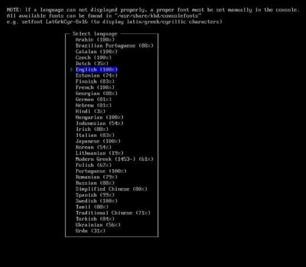

---

## 10. Schritt: Tastatur und Locale

Konfigurieren Sie anschließend die Tastaturbelegung und die gewünschten Locales.

Wählen Sie anschließend `Mirrors` aus.

---

## 11. Schritt: Mirrors auswählen

Belassen Sie die Mirror-Einstellungen nach Möglichkeit auf der automatischen Auswahl.

Dadurch kann `archinstall` passende Mirror-Server für Ihre Region auswählen.

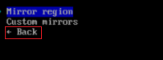

---

# Wichtig: Installationsdatenträger auswählen

## 12. Schritt: Festplattenkonfiguration

Jetzt kommt der **wichtigste Teil der Installation**.

Wählen Sie `Festplattenkonfiguration` beziehungsweise die entsprechende Option für die Disk-Konfiguration aus.

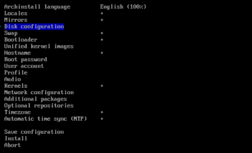

Sie müssen nun den Datenträger auswählen, auf dem Arch Linux installiert werden soll.

### Hier gilt:

**Der USB-Stick ist NICHT das Ziel der Installation.**

Der USB-Stick enthält lediglich das Arch-Linux-Installationsmedium.

Als Ziel wählen Sie Ihre **interne SSD/HDD** aus.

Beispielsweise könnte die interne SSD als:

```text
/dev/nvme0n1
```

angezeigt werden.

Eine SATA-Festplatte könnte beispielsweise als:

```text
/dev/sda
```

angezeigt werden.

> **ACHTUNG:** Die tatsächliche Bezeichnung kann bei Ihrem Computer anders sein. Überprüfen Sie deshalb unbedingt mit `lsblk`, welcher Datenträger die interne SSD/HDD ist.

---

## 13. Schritt: Partitionierung

Wenn Sie keine Erfahrung mit der manuellen Partitionierung haben, können Sie die automatische Partitionierung von `archinstall` verwenden.

Wählen Sie beispielsweise:

`Nach bestem Wissen und Gewissen verwenden`

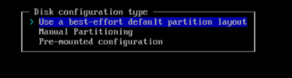

Danach müssen Sie den **internen Installationsdatenträger** auswählen.

> **WARNUNG:** Der ausgewählte Datenträger kann dabei vollständig gelöscht werden. Stellen Sie unbedingt sicher, dass Sie **nicht versehentlich den USB-Installationsstick auswählen**.

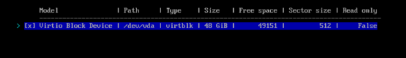

---

## 14. Schritt: Dateisystem auswählen

Wenn Sie keine besonderen Anforderungen haben, können Sie beispielsweise `ext4` auswählen.

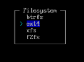

Bestätigen Sie anschließend die Auswahl.

---

## 15. Schritt: Swap

Aktivieren Sie `Swap`, wenn Sie Swap verwenden möchten.

Dies kann insbesondere bei Systemen mit wenig Arbeitsspeicher sinnvoll sein.

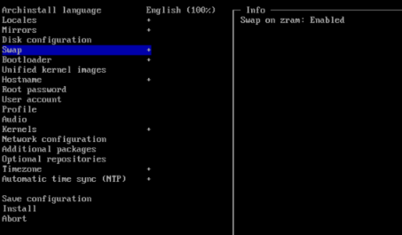

---

## 16. Schritt: Bootloader

Wählen Sie als Bootloader beispielsweise:

`GRUB`

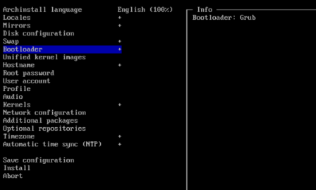

Der Bootloader wird dabei **auf dem internen Installationsdatenträger** eingerichtet.

Der USB-Stick bleibt weiterhin lediglich das Installationsmedium.

---

## 17. Schritt: Unified Kernel Images

Konfigurieren Sie `Unified kernel images` entsprechend Ihrer gewünschten Installation.

Wenn Sie dieser Anleitung folgen, können Sie die Option beispielsweise auf:

`Disabled`

stellen.

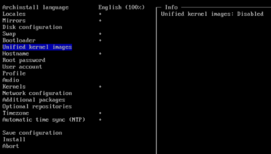

---

# Benutzer und Hostname

## 18. Schritt: Hostname, Root-Passwort und Benutzerkonto

Füllen Sie nun die entsprechenden Angaben aus.

### Hostname

```text
archlinux
```

### Root-Passwort

Verwenden Sie ein **eigenes, sicheres Passwort**.

> Verwenden Sie nicht das Beispielpasswort `Passwort123` für ein echtes System.

### Benutzerkonto

Username:

```text
user
```

Vergeben Sie anschließend ein sicheres Passwort für diesen Benutzer.

---

# Desktop-Umgebung

## 19. Schritt: Profil auswählen

Wählen Sie `Profil` aus.

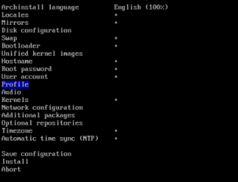

Anschließend wählen Sie `Typ`.


Für einen normalen Desktop-PC wählen Sie:

`Desktop`

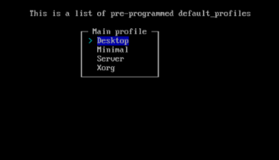

---

## 20. Schritt: Desktop-Umgebung auswählen

Nun können Sie die gewünschte Desktop-Umgebung auswählen.

Beispiele sind:

* GNOME
* KDE Plasma
* Cinnamon
* MATE

Für diese Installation verwenden wir:

`GNOME`

Wählen Sie GNOME aus und bestätigen Sie anschließend mit `Enter`.

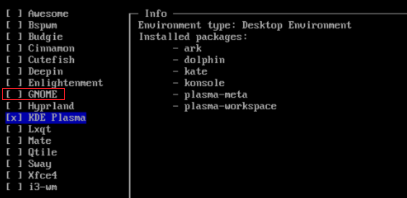

---

## 21. Schritt: Grafiktreiber

Wählen Sie anschließend die passenden Grafiktreiber für Ihre Hardware.

Wenn Sie sich nicht sicher sind, welche Auswahl für Ihre Hardware geeignet ist, sollten Sie sich vor der Installation über Ihre Grafikkarte und die aktuell von Arch unterstützten Treiber informieren.

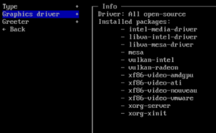

---

## 22. Schritt: Greeter

Wählen Sie anschließend den gewünschten Login-Manager beziehungsweise Greeter aus.

Beispielsweise:

`sddm`

Bestätigen Sie anschließend die Auswahl.

---

# Audio

## 23. Schritt: Audioserver

Wählen Sie beim Audioserver beispielsweise:

`PipeWire`

PipeWire ist für moderne Linux-Desktop-Systeme eine gängige Wahl.

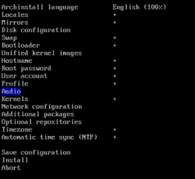

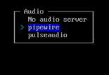

---

# Kernel

## 24. Schritt: Kernel auswählen

Wählen Sie als Kernel:

`linux`

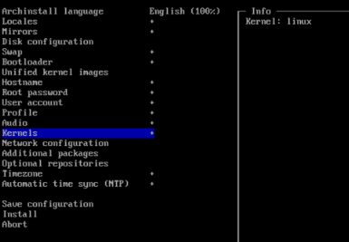

---

# Netzwerk

## 25. Schritt: NetworkManager

Wählen Sie als Netzwerkmanager:

`NetworkManager`

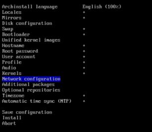

NetworkManager ermöglicht es Ihnen später, Netzwerkverbindungen komfortabel über Ihre Desktop-Umgebung zu verwalten.

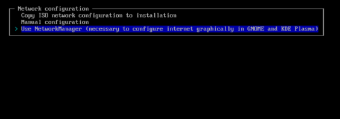

---

# Zusätzliche Pakete

## 26. Schritt: Zusätzliche Pakete

Sie können jetzt zusätzliche Programme auswählen, die direkt während der Installation installiert werden sollen.

Beispielsweise:

```text
firefox
git
fastfetch
htop
ansible
vlc
```

Wenn Sie mehrere Pakete auswählen möchten, können Sie diese entsprechend markieren.

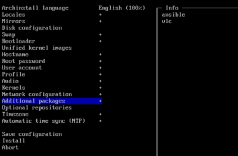

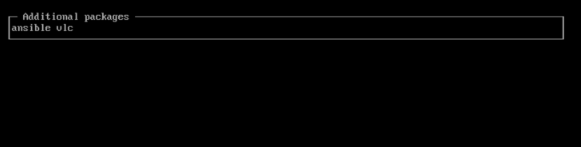

---

## 27. Schritt: Optionale Repositories

Konfigurieren Sie anschließend die optionalen Repositories nach Bedarf.

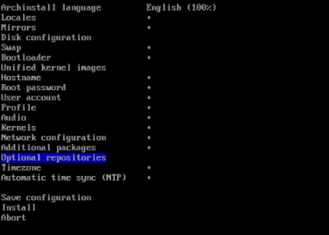

---

## 28. Schritt: Zeitzone

Wählen Sie nun Ihre Zeitzone aus.

Für Deutschland beispielsweise:

```text
Europe/Berlin
```

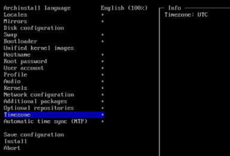

---

## 29. Schritt: Automatische Zeitsynchronisation

Aktivieren Sie `NTP`, wenn Datum und Uhrzeit automatisch synchronisiert werden sollen.

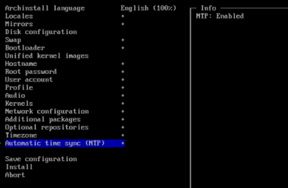

---

# Installation starten

## 30. Schritt: Einstellungen überprüfen

Sie haben nun die wichtigsten Einstellungen vorgenommen.

Überprüfen Sie **vor dem Start der Installation noch einmal alle Angaben**.

Besonders wichtig ist:

> **Ist wirklich die interne SSD/HDD als Installationsziel ausgewählt und nicht der USB-Stick?**

Wenn alles korrekt ist, starten Sie die Installation.

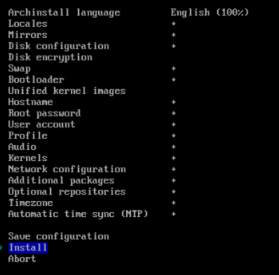

`archinstall` installiert Arch Linux nun auf der ausgewählten **internen SSD/HDD**.

Der USB-Stick wird dabei **nicht als Ziel für Arch Linux verwendet**.

---

# Nach der Installation

## 31. Schritt: Installation abschließen

Nachdem `archinstall` die Installation abgeschlossen hat, folgen Sie den Anweisungen auf dem Bildschirm.

Bevor Sie neu starten, sollten Sie den Arch-Linux-Installationsstick entfernen oder beim nächsten Start sicherstellen, dass von der internen SSD gebootet wird.

---

## 32. Schritt: Neustart

Starten Sie den Computer neu.

```bash
reboot
```

Entfernen Sie den USB-Stick, sobald der Computer neu startet.

Alternativ können Sie beim Booten das Boot-Menü öffnen und die **interne SSD** auswählen, auf der Arch Linux installiert wurde.

---

# Arch Linux vom internen Laufwerk starten

## 33. Schritt: Erstmaliger Start

Wenn die Installation erfolgreich war, sollte der Computer jetzt **ohne den USB-Stick** von der internen SSD/HDD starten.

Melden Sie sich mit dem zuvor eingerichteten Benutzerkonto an.

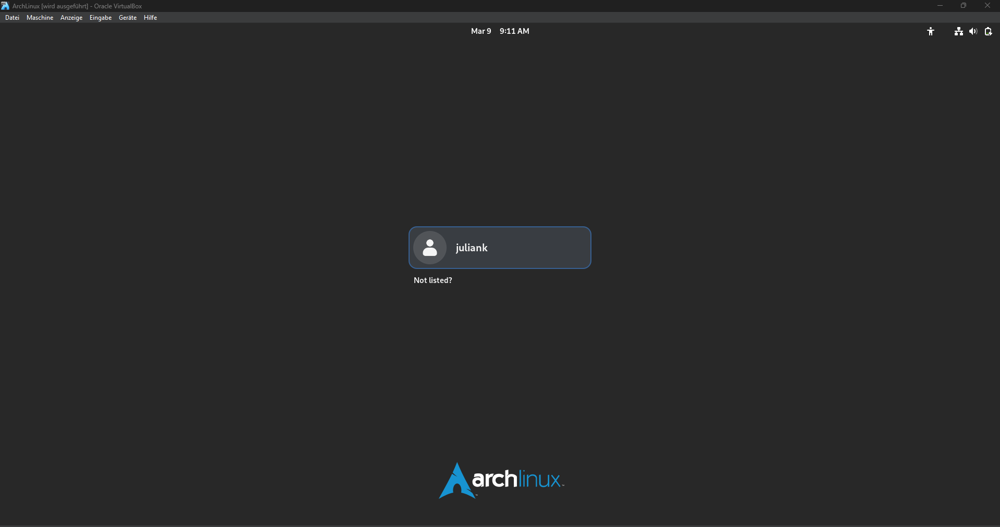

Wenn Sie GNOME ausgewählt haben, sollte anschließend die GNOME-Desktop-Umgebung erscheinen.

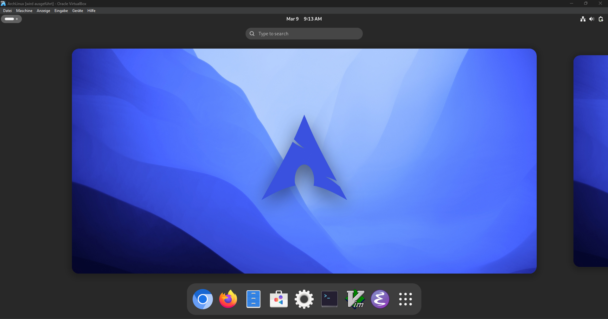

---

## 34. Schritt: Terminal öffnen

Öffnen Sie nun das Terminal.

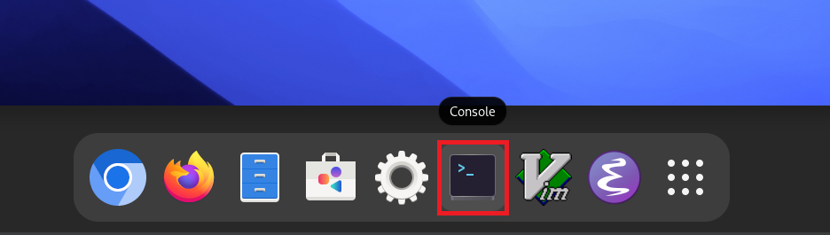

---

## 35. Schritt: System aktualisieren

Aktualisieren Sie zunächst Ihr System:

```bash
sudo pacman -Syu
```

Dadurch werden die installierten Pakete auf den aktuellen Stand gebracht.

---

## 36. Schritt: Entwicklungswerkzeuge und Kernel-Header installieren

Falls Sie Software kompilieren oder Kernel-Module benötigen, können Sie folgende Pakete installieren:

```bash
sudo pacman -S base-devel linux-headers
```

---

## 37. Schritt: Zusätzliche Programme installieren

Falls Firefox, VLC, LibreOffice, `wget` oder `curl` noch nicht installiert wurden, können Sie diese beispielsweise mit folgendem Befehl installieren:

```bash
sudo pacman -S firefox vlc libreoffice-fresh wget curl
```

---

## 38. Schritt: Flatpak installieren

Falls Sie Flatpak verwenden möchten, installieren Sie das Paket mit:

```bash
sudo pacman -S flatpak
```

Anschließend können Sie Flatpak-Anwendungen nach Bedarf installieren.

---

# Installation überprüfen

## 39. Schritt: Systeminformationen anzeigen

Mit `fastfetch` können Sie Informationen über Ihr installiertes System anzeigen:

```bash
fastfetch
```

Hier werden unter anderem Informationen über Arch Linux, den Kernel, die Hardware und die Desktop-Umgebung angezeigt.

---

## 40. Schritt: Laufwerke überprüfen

Öffnen Sie erneut das Terminal und geben Sie ein:

```bash
lsblk
```

Nun sollte die interne SSD/HDD mit den Partitionen Ihres installierten Arch-Linux-Systems angezeigt werden.

Der USB-Stick muss zu diesem Zeitpunkt nicht mehr angeschlossen sein.

---

## 41. Schritt: Persönliche Dateien überprüfen

Öffnen Sie den Dateimanager `Files`.

Überprüfen Sie Ihre persönlichen Verzeichnisse.

Sie können beispielsweise das Verzeichnis `Documents` öffnen und dort Dateien speichern.

---

## 42. Schritt: Terminal testen

Wechseln Sie im Terminal in den Ordner `Documents`:

```bash
cd Documents
```

Zeigen Sie anschließend die enthaltenen Dateien an:

```bash
ls
```

Wenn Ihre Dateien angezeigt werden, funktioniert der Zugriff auf das Dateisystem.

---

## 43. Schritt: Letzten Neustart durchführen

Wenn alles funktioniert, können Sie das System noch einmal neu starten:

```bash
sudo reboot
```

**Wichtig:** Lassen Sie den USB-Stick diesmal entfernt.

Der Computer sollte nun direkt von der internen SSD/HDD starten.

---

# Fertig!

Damit ist Arch Linux **auf der internen SSD/HDD installiert** und kann als normales Hauptbetriebssystem verwendet werden.

Der USB-Stick wurde dabei **nur als Installations- und Bootmedium verwendet**.

Der grundlegende Ablauf sieht also so aus:

```text
USB-Stick
    │
    │  Arch-Linux-ISO
    ▼
Computer startet vom USB-Stick
    │
    │  archinstall
    ▼
Interne SSD/HDD
    │
    │  Arch Linux wird hier installiert
    ▼
Computer startet anschließend
    │
    ▼
Arch Linux von der internen SSD/HDD
```

**Der USB-Stick wird nach der Installation nicht mehr benötigt.**
